# 架构设计文档

本文档使用 Mermaid 图表详细展示 Simple 编译器/解释器的系统架构。

> **注意**: Mermaid 图表可以在 GitHub、GitLab、VS Code (需插件)、Typora 等支持 Mermaid 的环境中渲染。

## 目录

1. [系统整体架构](#1-系统整体架构)
2. [模块关系](#2-模块关系)
3. [数据流](#3-数据流)
4. [编译流程](#4-编译流程)
5. [虚拟机执行流程](#5-虚拟机执行流程)
6. [类图](#6-类图)

---

## 1. 系统整体架构

### 1.1 高层架构图

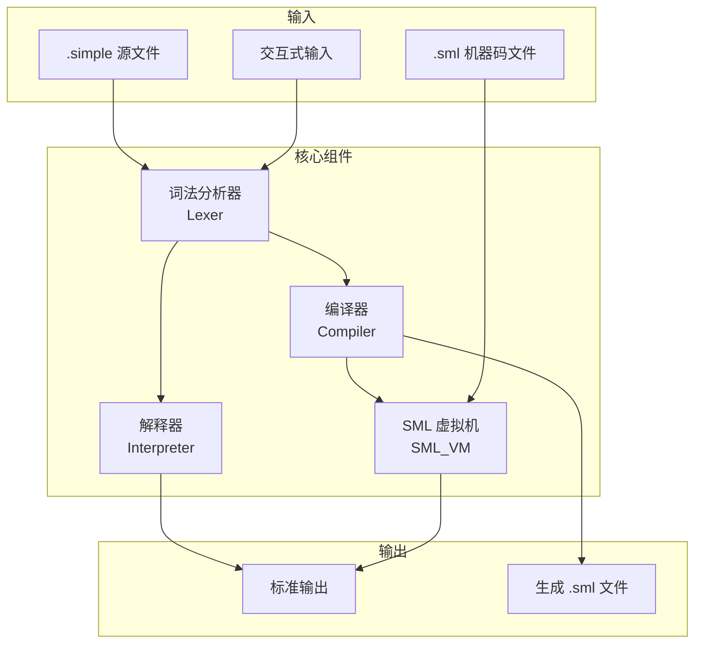
```mermaid
flowchart TB
    subgraph Input["输入"]
        SOURCE[".simple 源文件"]
        SML[".sml 机器码文件"]
        REPL["交互式输入"]
    end

    subgraph Core["核心组件"]
        LEXER["词法分析器<br/>Lexer"]
        INTERP["解释器<br/>Interpreter"]
        COMP["编译器<br/>Compiler"]
        VM["SML 虚拟机<br/>SML_VM"]
    end

    subgraph Output["输出"]
        STDOUT["标准输出"]
        SMLFILE["生成 .sml 文件"]
    end

    SOURCE --> LEXER
    REPL --> LEXER
    LEXER --> INTERP
    LEXER --> COMP
    COMP --> SMLFILE
    COMP --> VM
    SML --> VM
    INTERP --> STDOUT
    VM --> STDOUT
```

### 1.2 运行模式

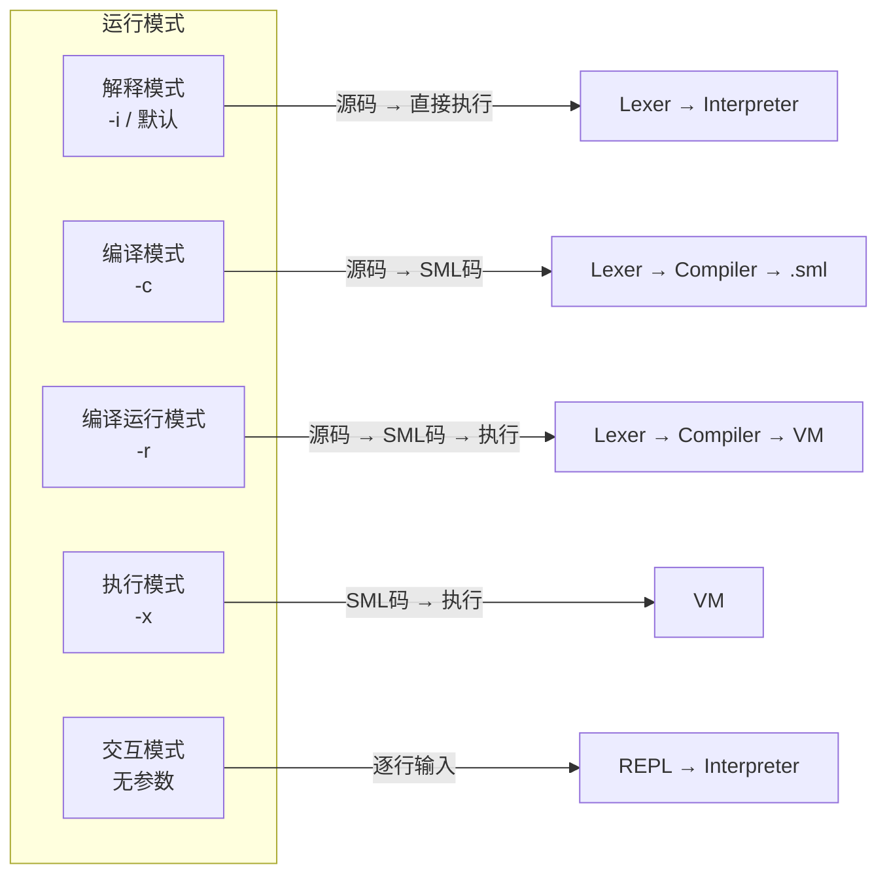
```mermaid
flowchart LR
    subgraph Modes["运行模式"]
        M1["解释模式<br/>-i / 默认"]
        M2["编译模式<br/>-c"]
        M3["编译运行模式<br/>-r"]
        M4["执行模式<br/>-x"]
        M5["交互模式<br/>无参数"]
    end

    M1 --> |"源码 → 直接执行"| R1["Lexer → Interpreter"]
    M2 --> |"源码 → SML码"| R2["Lexer → Compiler → .sml"]
    M3 --> |"源码 → SML码 → 执行"| R3["Lexer → Compiler → VM"]
    M4 --> |"SML码 → 执行"| R4["VM"]
    M5 --> |"逐行输入"| R5["REPL → Interpreter"]
```

---

## 2. 模块关系

### 2.1 模块依赖图

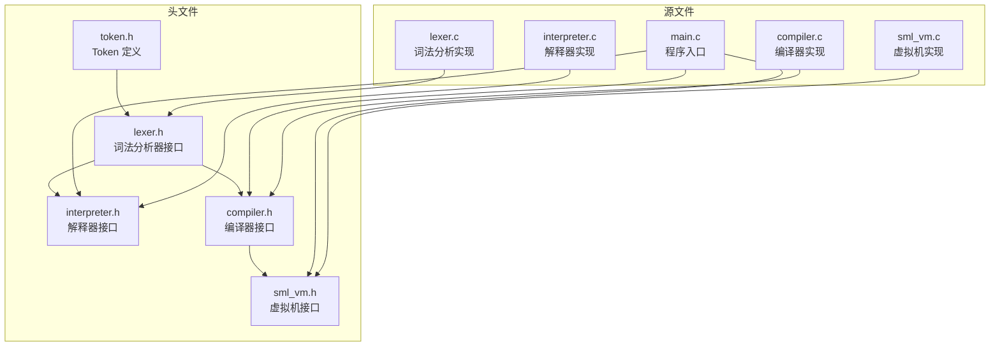
```mermaid
flowchart TB
    subgraph Headers["头文件"]
        TOKEN["token.h<br/>Token 定义"]
        LEXER_H["lexer.h<br/>词法分析器接口"]
        INTERP_H["interpreter.h<br/>解释器接口"]
        COMP_H["compiler.h<br/>编译器接口"]
        VM_H["sml_vm.h<br/>虚拟机接口"]
    end

    subgraph Sources["源文件"]
        MAIN["main.c<br/>程序入口"]
        LEXER_C["lexer.c<br/>词法分析实现"]
        INTERP_C["interpreter.c<br/>解释器实现"]
        COMP_C["compiler.c<br/>编译器实现"]
        VM_C["sml_vm.c<br/>虚拟机实现"]
    end

    TOKEN --> LEXER_H
    LEXER_H --> INTERP_H
    LEXER_H --> COMP_H
    COMP_H --> VM_H

    MAIN --> INTERP_H
    MAIN --> COMP_H
    MAIN --> VM_H

    LEXER_C --> LEXER_H
    INTERP_C --> INTERP_H
    COMP_C --> COMP_H
    VM_C --> VM_H
```

### 2.2 数据结构关系

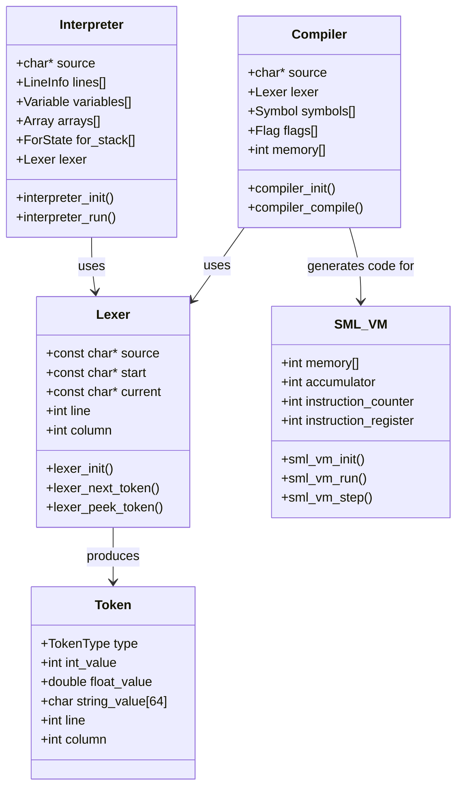
```mermaid
classDiagram
    class Token {
        +TokenType type
        +int int_value
        +double float_value
        +char string_value[64]
        +int line
        +int column
    }

    class Lexer {
        +const char* source
        +const char* start
        +const char* current
        +int line
        +int column
        +lexer_init()
        +lexer_next_token()
        +lexer_peek_token()
    }

    class Interpreter {
        +char* source
        +LineInfo lines[]
        +Variable variables[]
        +Array arrays[]
        +ForState for_stack[]
        +Lexer lexer
        +interpreter_init()
        +interpreter_run()
    }

    class Compiler {
        +char* source
        +Lexer lexer
        +Symbol symbols[]
        +Flag flags[]
        +int memory[]
        +compiler_init()
        +compiler_compile()
    }

    class SML_VM {
        +int memory[]
        +int accumulator
        +int instruction_counter
        +int instruction_register
        +sml_vm_init()
        +sml_vm_run()
        +sml_vm_step()
    }

    Lexer --> Token : produces
    Interpreter --> Lexer : uses
    Compiler --> Lexer : uses
    Compiler --> SML_VM : generates code for
```

---

## 3. 数据流

### 3.1 解释器数据流

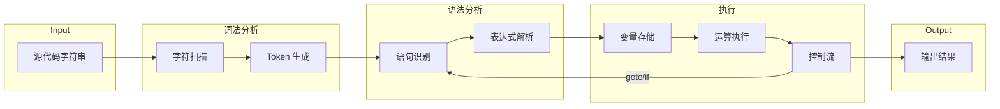
```mermaid
flowchart LR
    subgraph Input
        SRC["源代码字符串"]
    end

    subgraph Lexer["词法分析"]
        L1["字符扫描"]
        L2["Token 生成"]
    end

    subgraph Parser["语法分析"]
        P1["语句识别"]
        P2["表达式解析"]
    end

    subgraph Executor["执行"]
        E1["变量存储"]
        E2["运算执行"]
        E3["控制流"]
    end

    subgraph Output
        OUT["输出结果"]
    end

    SRC --> L1 --> L2 --> P1 --> P2 --> E1
    E1 --> E2 --> E3 --> OUT
    E3 -->|"goto/if"| P1
```

### 3.2 编译器数据流

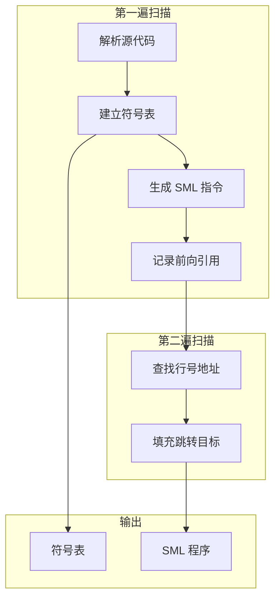
```mermaid
flowchart TB
    subgraph Pass1["第一遍扫描"]
        P1_1["解析源代码"]
        P1_2["建立符号表"]
        P1_3["生成 SML 指令"]
        P1_4["记录前向引用"]
    end

    subgraph Pass2["第二遍扫描"]
        P2_1["查找行号地址"]
        P2_2["填充跳转目标"]
    end

    subgraph Output["输出"]
        OUT1["符号表"]
        OUT2["SML 程序"]
    end

    P1_1 --> P1_2 --> P1_3 --> P1_4
    P1_4 --> P2_1 --> P2_2
    P1_2 --> OUT1
    P2_2 --> OUT2
```

### 3.3 内存布局

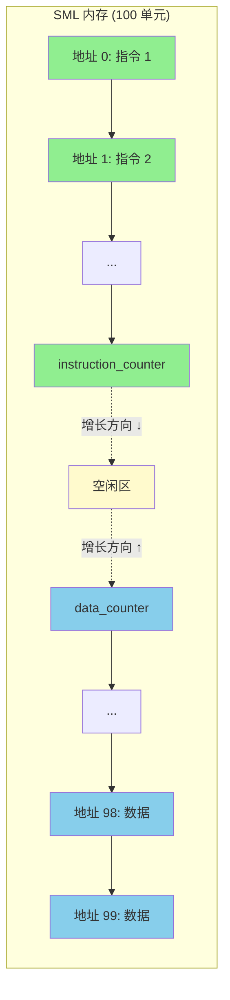
```mermaid
flowchart TB
    subgraph Memory["SML 内存 (100 单元)"]
        direction TB
        I0["地址 0: 指令 1"]
        I1["地址 1: 指令 2"]
        I2["..."]
        IC["instruction_counter"]
        FREE["空闲区"]
        DC["data_counter"]
        D2["..."]
        D1["地址 98: 数据"]
        D0["地址 99: 数据"]
    end

    I0 --> I1 --> I2 --> IC
    IC -.->|"增长方向 ↓"| FREE
    FREE -.->|"增长方向 ↑"| DC
    DC --> D2 --> D1 --> D0

    style I0 fill:#90EE90
    style I1 fill:#90EE90
    style IC fill:#90EE90
    style FREE fill:#FFFACD
    style DC fill:#87CEEB
    style D1 fill:#87CEEB
    style D0 fill:#87CEEB
```

---

## 4. 编译流程

### 4.1 语句编译流程

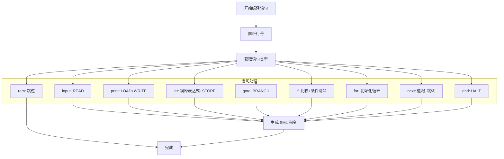
```mermaid
flowchart TB
    START["开始编译语句"]
    PARSE_LINE["解析行号"]
    GET_STMT["获取语句类型"]

    subgraph Statements["语句处理"]
        REM["rem: 跳过"]
        INPUT["input: READ"]
        PRINT["print: LOAD+WRITE"]
        LET["let: 编译表达式+STORE"]
        GOTO["goto: BRANCH"]
        IF["if: 比较+条件跳转"]
        FOR["for: 初始化循环"]
        NEXT["next: 递增+跳转"]
        END["end: HALT"]
    end

    EMIT["生成 SML 指令"]
    FINISH["完成"]

    START --> PARSE_LINE --> GET_STMT
    GET_STMT --> REM --> FINISH
    GET_STMT --> INPUT --> EMIT
    GET_STMT --> PRINT --> EMIT
    GET_STMT --> LET --> EMIT
    GET_STMT --> GOTO --> EMIT
    GET_STMT --> IF --> EMIT
    GET_STMT --> FOR --> EMIT
    GET_STMT --> NEXT --> EMIT
    GET_STMT --> END --> EMIT
    EMIT --> FINISH
```

### 4.2 表达式编译流程

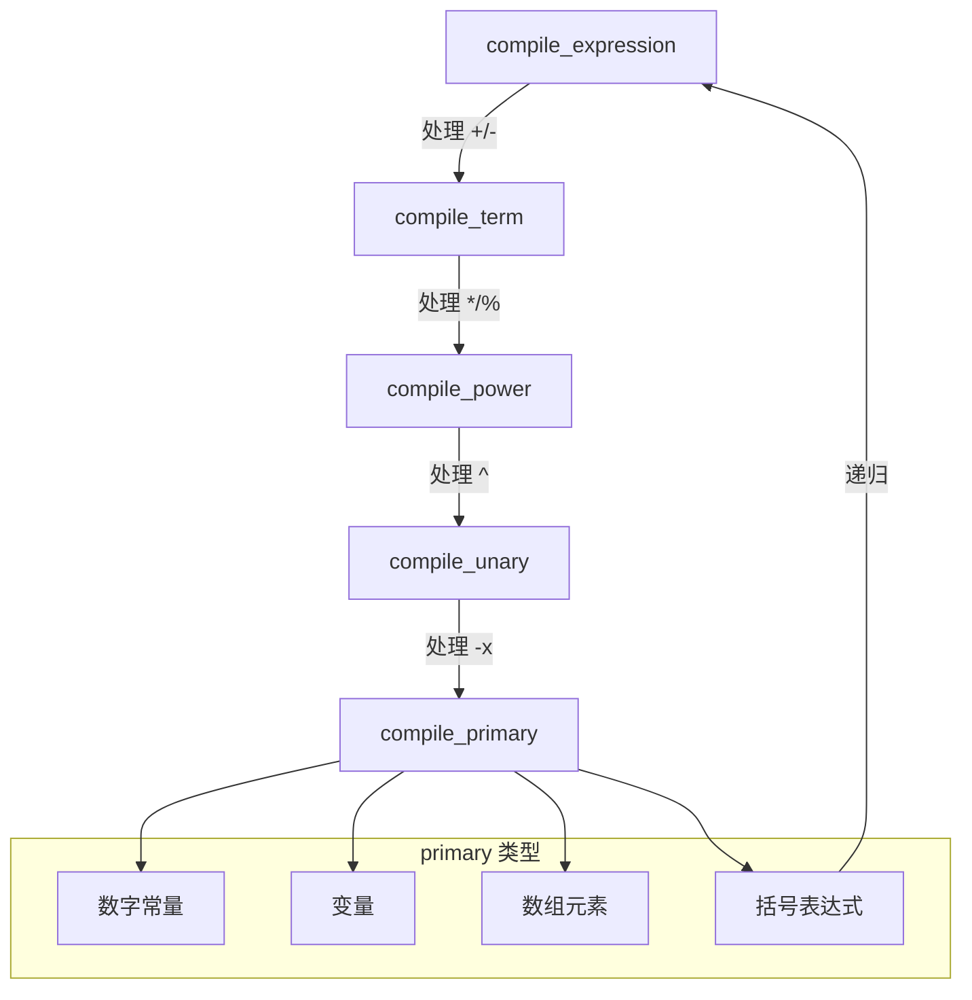
```mermaid
flowchart TB
    EXP["compile_expression"]
    TERM["compile_term"]
    POWER["compile_power"]
    UNARY["compile_unary"]
    PRIMARY["compile_primary"]

    subgraph Primary["primary 类型"]
        NUM["数字常量"]
        VAR["变量"]
        ARR["数组元素"]
        PAREN["括号表达式"]
    end

    EXP -->|"处理 +/-"| TERM
    TERM -->|"处理 */%"| POWER
    POWER -->|"处理 ^"| UNARY
    UNARY -->|"处理 -x"| PRIMARY
    PRIMARY --> NUM
    PRIMARY --> VAR
    PRIMARY --> ARR
    PRIMARY --> PAREN
    PAREN -->|"递归"| EXP
```

### 4.3 前向引用解析

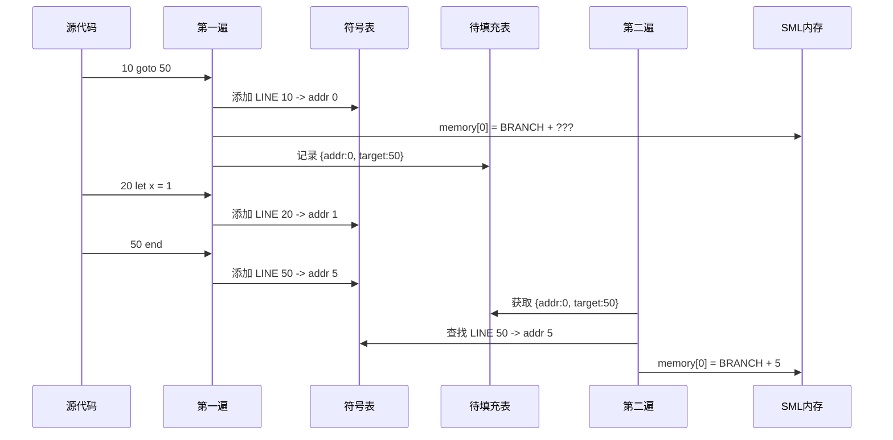
```mermaid
sequenceDiagram
    participant Source as 源代码
    participant Pass1 as 第一遍
    participant SymTable as 符号表
    participant Flags as 待填充表
    participant Pass2 as 第二遍
    participant Memory as SML内存

    Source->>Pass1: 10 goto 50
    Pass1->>SymTable: 添加 LINE 10 -> addr 0
    Pass1->>Memory: memory[0] = BRANCH + ???
    Pass1->>Flags: 记录 {addr:0, target:50}

    Source->>Pass1: 20 let x = 1
    Pass1->>SymTable: 添加 LINE 20 -> addr 1

    Source->>Pass1: 50 end
    Pass1->>SymTable: 添加 LINE 50 -> addr 5

    Pass2->>Flags: 获取 {addr:0, target:50}
    Pass2->>SymTable: 查找 LINE 50 -> addr 5
    Pass2->>Memory: memory[0] = BRANCH + 5
```

---

## 5. 虚拟机执行流程

### 5.1 Fetch-Decode-Execute 循环

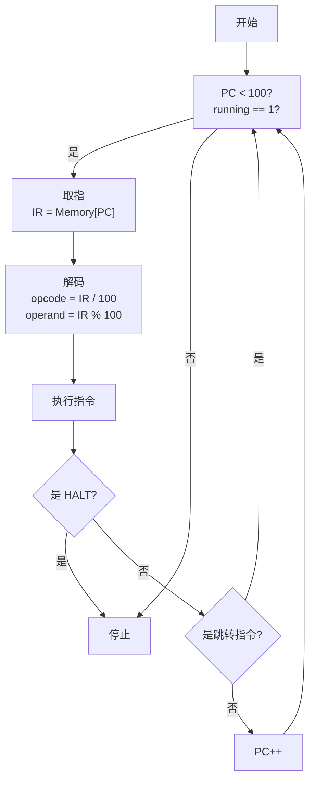
```mermaid
flowchart TB
    START["开始"]
    CHECK["PC < 100?<br/>running == 1?"]
    FETCH["取指<br/>IR = Memory[PC]"]
    DECODE["解码<br/>opcode = IR / 100<br/>operand = IR % 100"]
    EXECUTE["执行指令"]
    HALT_CHECK{"是 HALT?"}
    JUMP_CHECK{"是跳转指令?"}
    INC_PC["PC++"]
    STOP["停止"]

    START --> CHECK
    CHECK -->|"是"| FETCH
    CHECK -->|"否"| STOP
    FETCH --> DECODE --> EXECUTE
    EXECUTE --> HALT_CHECK
    HALT_CHECK -->|"是"| STOP
    HALT_CHECK -->|"否"| JUMP_CHECK
    JUMP_CHECK -->|"是"| CHECK
    JUMP_CHECK -->|"否"| INC_PC --> CHECK
```

### 5.2 指令执行状态机

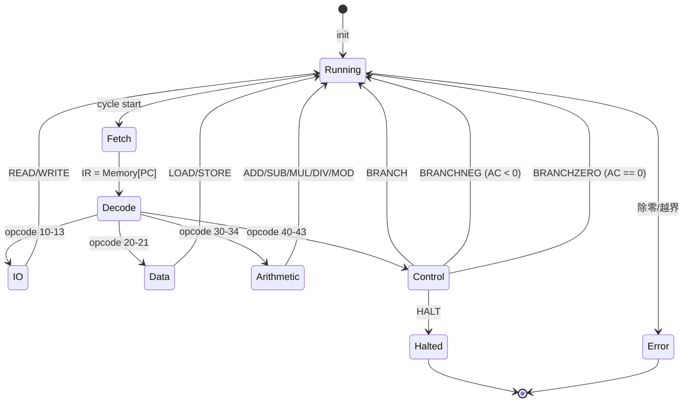
```mermaid
stateDiagram-v2
    [*] --> Running: init

    Running --> Fetch: cycle start
    Fetch --> Decode: IR = Memory[PC]

    Decode --> IO: opcode 10-13
    Decode --> Data: opcode 20-21
    Decode --> Arithmetic: opcode 30-34
    Decode --> Control: opcode 40-43

    IO --> Running: READ/WRITE
    Data --> Running: LOAD/STORE
    Arithmetic --> Running: ADD/SUB/MUL/DIV/MOD

    Control --> Running: BRANCH
    Control --> Running: BRANCHNEG (AC < 0)
    Control --> Running: BRANCHZERO (AC == 0)
    Control --> Halted: HALT

    Running --> Error: 除零/越界

    Halted --> [*]
    Error --> [*]
```

### 5.3 指令集概览

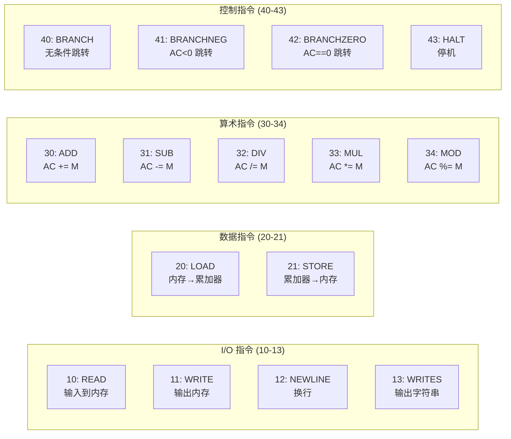
```mermaid
flowchart LR
    subgraph IO["I/O 指令 (10-13)"]
        READ["10: READ<br/>输入到内存"]
        WRITE["11: WRITE<br/>输出内存"]
        NEWLINE["12: NEWLINE<br/>换行"]
        WRITES["13: WRITES<br/>输出字符串"]
    end

    subgraph Data["数据指令 (20-21)"]
        LOAD["20: LOAD<br/>内存→累加器"]
        STORE["21: STORE<br/>累加器→内存"]
    end

    subgraph Arith["算术指令 (30-34)"]
        ADD["30: ADD<br/>AC += M"]
        SUB["31: SUB<br/>AC -= M"]
        DIV["32: DIV<br/>AC /= M"]
        MUL["33: MUL<br/>AC *= M"]
        MOD["34: MOD<br/>AC %= M"]
    end

    subgraph Control["控制指令 (40-43)"]
        BRANCH["40: BRANCH<br/>无条件跳转"]
        BRANCHNEG["41: BRANCHNEG<br/>AC<0 跳转"]
        BRANCHZERO["42: BRANCHZERO<br/>AC==0 跳转"]
        HALT["43: HALT<br/>停机"]
    end
```

---

## 6. 类图

### 6.1 Token 类型枚举

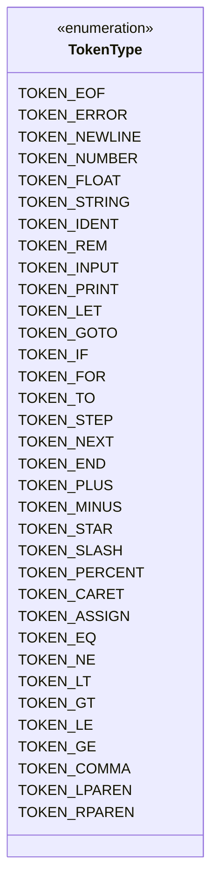
```mermaid
classDiagram
    class TokenType {
        <<enumeration>>
        TOKEN_EOF
        TOKEN_ERROR
        TOKEN_NEWLINE
        TOKEN_NUMBER
        TOKEN_FLOAT
        TOKEN_STRING
        TOKEN_IDENT
        TOKEN_REM
        TOKEN_INPUT
        TOKEN_PRINT
        TOKEN_LET
        TOKEN_GOTO
        TOKEN_IF
        TOKEN_FOR
        TOKEN_TO
        TOKEN_STEP
        TOKEN_NEXT
        TOKEN_END
        TOKEN_PLUS
        TOKEN_MINUS
        TOKEN_STAR
        TOKEN_SLASH
        TOKEN_PERCENT
        TOKEN_CARET
        TOKEN_ASSIGN
        TOKEN_EQ
        TOKEN_NE
        TOKEN_LT
        TOKEN_GT
        TOKEN_LE
        TOKEN_GE
        TOKEN_COMMA
        TOKEN_LPAREN
        TOKEN_RPAREN
    }
```

### 6.2 SML 操作码枚举

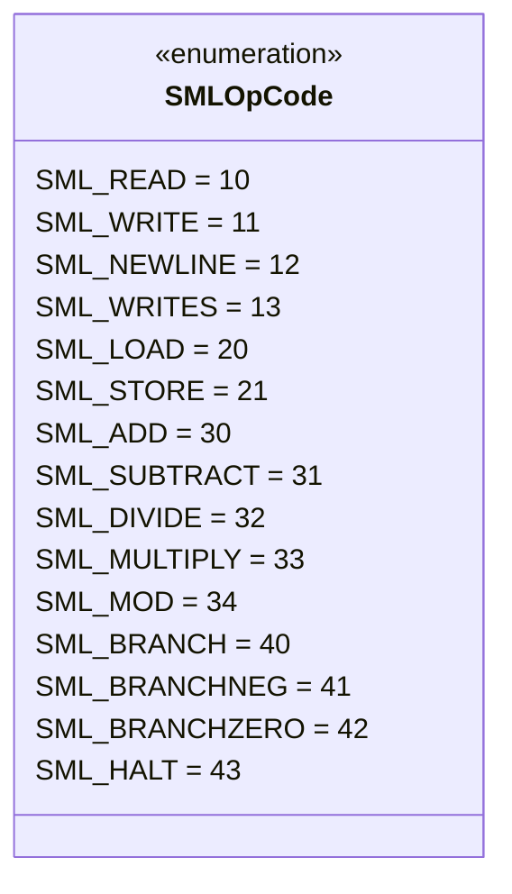
```mermaid
classDiagram
    class SMLOpCode {
        <<enumeration>>
        SML_READ = 10
        SML_WRITE = 11
        SML_NEWLINE = 12
        SML_WRITES = 13
        SML_LOAD = 20
        SML_STORE = 21
        SML_ADD = 30
        SML_SUBTRACT = 31
        SML_DIVIDE = 32
        SML_MULTIPLY = 33
        SML_MOD = 34
        SML_BRANCH = 40
        SML_BRANCHNEG = 41
        SML_BRANCHZERO = 42
        SML_HALT = 43
    }
```

### 6.3 符号表结构

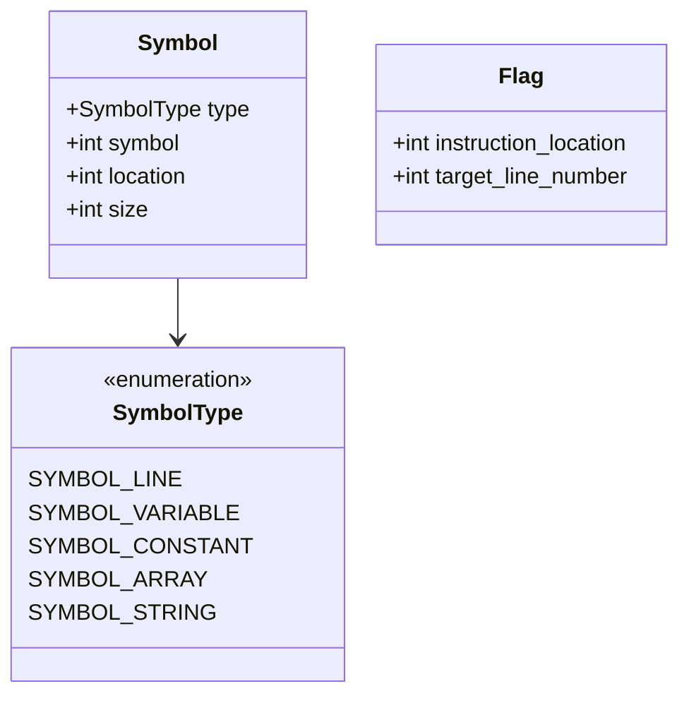
```mermaid
classDiagram
    class SymbolType {
        <<enumeration>>
        SYMBOL_LINE
        SYMBOL_VARIABLE
        SYMBOL_CONSTANT
        SYMBOL_ARRAY
        SYMBOL_STRING
    }

    class Symbol {
        +SymbolType type
        +int symbol
        +int location
        +int size
    }

    class Flag {
        +int instruction_location
        +int target_line_number
    }

    Symbol --> SymbolType
```

---

## 7. 序列图

### 7.1 编译并运行流程

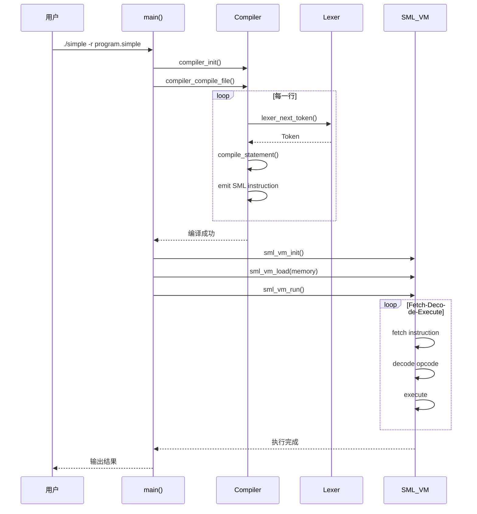
```mermaid
sequenceDiagram
    participant User as 用户
    participant Main as main()
    participant Comp as Compiler
    participant Lexer as Lexer
    participant VM as SML_VM

    User->>Main: ./simple -r program.simple
    Main->>Comp: compiler_init()
    Main->>Comp: compiler_compile_file()

    loop 每一行
        Comp->>Lexer: lexer_next_token()
        Lexer-->>Comp: Token
        Comp->>Comp: compile_statement()
        Comp->>Comp: emit SML instruction
    end

    Comp-->>Main: 编译成功
    Main->>VM: sml_vm_init()
    Main->>VM: sml_vm_load(memory)
    Main->>VM: sml_vm_run()

    loop Fetch-Decode-Execute
        VM->>VM: fetch instruction
        VM->>VM: decode opcode
        VM->>VM: execute
    end

    VM-->>Main: 执行完成
    Main-->>User: 输出结果
```

### 7.2 解释器执行流程

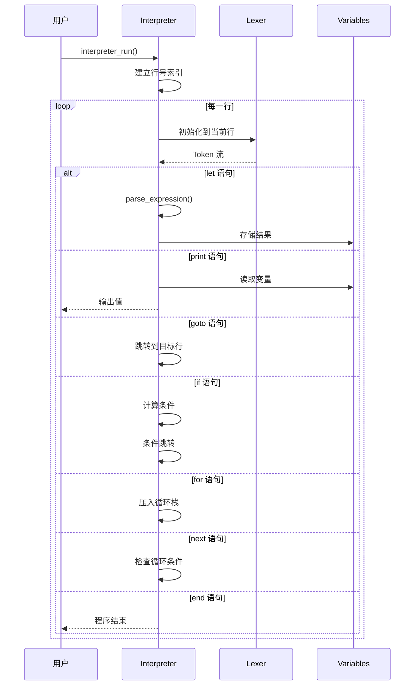
```mermaid
sequenceDiagram
    participant User as 用户
    participant Interp as Interpreter
    participant Lexer as Lexer
    participant Vars as Variables

    User->>Interp: interpreter_run()
    Interp->>Interp: 建立行号索引

    loop 每一行
        Interp->>Lexer: 初始化到当前行
        Lexer-->>Interp: Token 流

        alt let 语句
            Interp->>Interp: parse_expression()
            Interp->>Vars: 存储结果
        else print 语句
            Interp->>Vars: 读取变量
            Interp-->>User: 输出值
        else goto 语句
            Interp->>Interp: 跳转到目标行
        else if 语句
            Interp->>Interp: 计算条件
            Interp->>Interp: 条件跳转
        else for 语句
            Interp->>Interp: 压入循环栈
        else next 语句
            Interp->>Interp: 检查循环条件
        else end 语句
            Interp-->>User: 程序结束
        end
    end
```

---

## 8. 部署图

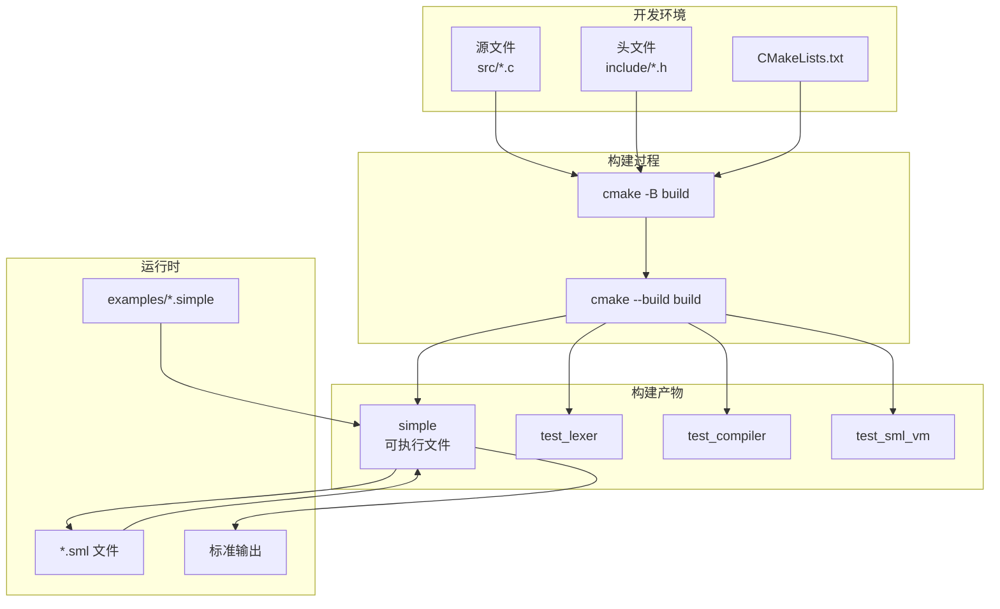
```mermaid
flowchart TB
    subgraph Development["开发环境"]
        SRC_FILES["源文件<br/>src/*.c"]
        HDR_FILES["头文件<br/>include/*.h"]
        CMAKE["CMakeLists.txt"]
    end

    subgraph Build["构建过程"]
        CMAKE_CMD["cmake -B build"]
        MAKE["cmake --build build"]
    end

    subgraph Output["构建产物"]
        SIMPLE["simple<br/>可执行文件"]
        TEST_LEXER["test_lexer"]
        TEST_COMP["test_compiler"]
        TEST_VM["test_sml_vm"]
    end

    subgraph Runtime["运行时"]
        EXAMPLES["examples/*.simple"]
        SML_FILES["*.sml 文件"]
        STDOUT["标准输出"]
    end

    SRC_FILES --> CMAKE_CMD
    HDR_FILES --> CMAKE_CMD
    CMAKE --> CMAKE_CMD
    CMAKE_CMD --> MAKE
    MAKE --> SIMPLE
    MAKE --> TEST_LEXER
    MAKE --> TEST_COMP
    MAKE --> TEST_VM

    EXAMPLES --> SIMPLE --> STDOUT
    SIMPLE --> SML_FILES --> SIMPLE
```

---

## 总结

本架构文档展示了 Simple 编译器/解释器的完整系统设计：

1. **分层架构**: 词法分析 → 语法分析 → 代码生成/执行
2. **模块化设计**: 各组件职责明确，接口清晰
3. **两种执行路径**: 解释执行和编译执行
4. **冯诺依曼架构**: SML 虚拟机实现经典的 Fetch-Decode-Execute 循环

通过这些图表，可以清晰理解整个系统的工作原理和数据流动。
